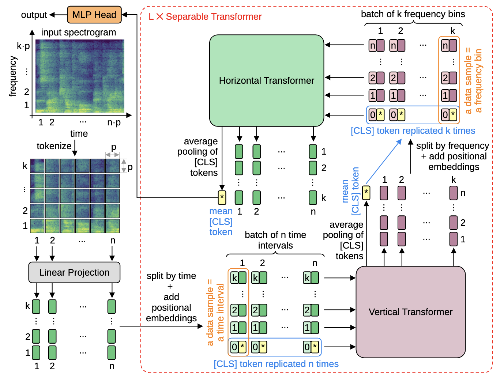

#  SepTr: Separable Transformer for Audio Spectrogram Processing (official)                                                                                  

We propose the Separable Transformer (SepTr), an architecture that employs two transformer blocks in a sequential manner, the first attending to tokens within the same frequency bin, 
and the second attending to tokens within the same time interval.

The original paper could be found at: TBA

This code is released under the [CC BY-SA 4.0](https://creativecommons.org/licenses/by-sa/4.0/) license.

-----------------------------------------



-----------------------------------------                                                                                                                                      
## Information
The architecture does not impose a certain axis (time or frequency) for the first transformer block, being flexible in this regard. 
Without loss of generality, in the above Figure, we illustrate a model that separates the tokens along the time axis first. 
Our separable transformer block can be repeated L times to increase the depth of the architecture. 
The final prediction of our model is predicted by the MLP block.


## Implementation

We implemented the model in PyTorch and provide all scripts to run our architecture.
> In order to work properly you need to have a python version newer than 3.6
> (We used the python 3.6.8 version).


## Cite us
```
TBA
```

## Related Projects
[pytorch-vit](https://github.com/lucidrains/vit-pytorch)

## You can send your questions or suggestions to: 
r.catalin196@yahoo.ro, raducu.ionescu@gmail.com

### Last Update:
March 18, 2022 


